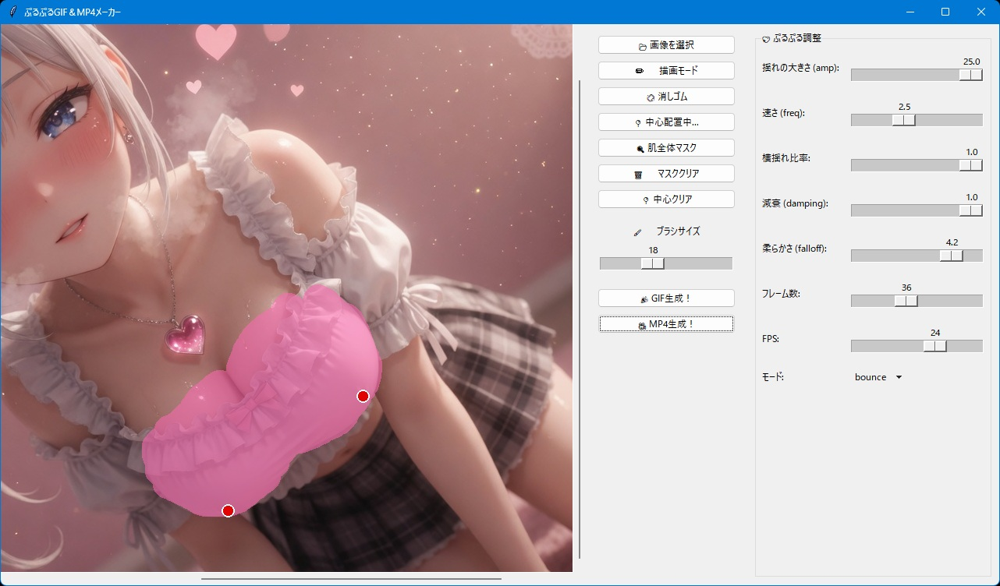

# ぷるぷるGIF＆MP4メーカー

## これは何？

柔らかそうな物を「ぷるぷる」させるツールです。

## 使い方
1. `purupuru.py` を実行。
2. 画像を選択。
3. 「描画モード」にして画像中の柔らかそうなところをマスク。
4. 「中心配置」にして柔らかそうな物をぷるぷるさせる中心点を選択。（主に２箇所）
5. 「GIF生成」 or 「MP4生成」ボタンを押して生成。

## 必要環境
- Python 3.10以上
- 必要なライブラリはソースコードの先頭に書いてあります。

## 実行テスト

元画像

生成

<video src="https://github.com/mf235/purupuru/images/test.mp4" width="320" height="240" controls></video>

## ライセンス

**MIT License** で公開しています。  
ご自由に使って、改変して、参考にしてください。  
ただし**自作発言はNG**でお願いします。
